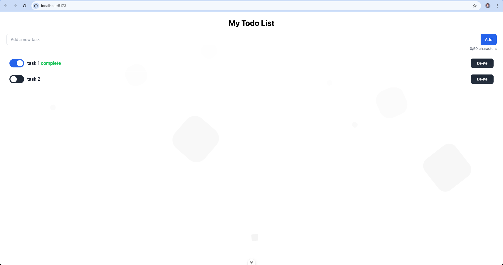

# Todo List Application

This is a full-stack Todo List Application built using Vue.js for the frontend and AdonisJS for the backend. The application allows users to add, update, delete, and mark tasks as completed. It also features responsive design for mobile and web views.

## Features
- Add new tasks
- Delete tasks
- Mark tasks as completed
- Responsive design for mobile and web
- RESTful API for handling CRUD operations
- Data stored in MariaDB or PostgreSQL

## Technologies Used
### Frontend
- Vue.js 3
- TypeScript
- Tailwind CSS

### Backend
- AdonisJS 5
- TypeScript
- MariaDB / PostgreSQL

## Installation and Setup

### Prerequisites
- Node.js (v14 or above)
- npm or yarn
- MariaDB or PostgreSQL

### Clone the Repository
```bash
git clone https://github.com/Fujipp/vue-todo-app-adonisjs-backend.git
cd vue-todo-app-adonisjs-backend
```


## Frontend Setup

### Prerequisites
- Node.js (v14 or above)
- npm or yarn

### Steps to Setup
1. Navigate to the `frontend` directory:
```bash
cd todo-app
```
2. Install dependencies:
```bash
npm install
```
3. Run the development server:
```bash
npm run dev
```

The frontend application will be available at `http://localhost:5173/`.

## Backend Setup

### Prerequisites
- Node.js (v14 or above)
- npm or yarn
- MariaDB or PostgreSQL

### Steps to Setup
1. Navigate to the `backend` directory:
```bash
cd todo-api
```
2. Install dependencies:
```bash
npm install
```
3. Create a `.env` file in the `backend` directory and configure the database connection:
```bash
DB_CONNECTION=mysql
MYSQL_HOST=127.0.0.1
MYSQL_PORT=3306
MYSQL_USER=your_db_user
MYSQL_PASSWORD=your_db_password
MYSQL_DB_NAME=todo_db
```
4. Run the database migrations to set up the database schema:
```bash
node ace migration:run
```
5. Start the AdonisJS server:
```bash
node ace serve --watch
```

The backend server will be available at `http://localhost:3333`.


## API Endpoints

### Base URL
`http://localhost:3333`

### List of Endpoints

- **GET /todos**
  - **Description**: Retrieve all todo items.
  - **Path**: `/todos`
  - **Response**: Returns an array of todo items.

- **POST /todos**
  - **Description**: Create a new todo item.
  - **Path**: `/todos`
  - **Body**:
    ```json
    {
      "text": "New task",
      "completed": false
    }
    ```
  - **Response**: Returns the created todo item with its `id`.

- **PUT /todos/:id**
  - **Description**: Update a todo item by its `id`.
  - **Path**: `/todos/:id` (replace `:id` with the actual todo `id`)
  - **Body**:
    ```json
    {
      "text": "Updated task text",
      "completed": true
    }
    ```
  - **Response**: Returns the updated todo item.

- **DELETE /todos/:id**
  - **Description**: Delete a todo item by its `id`.
  - **Path**: `/todos/:id` (replace `:id` with the actual todo `id`)
  - **Response**: Returns a status of `204 No Content` if the deletion is successful.


## Postman Collection
You can find the Postman collection for testing in the repository under `todo-api.postman_collection.json`.

## Screenshots


## License
This project is licensed under the MIT License. See the LICENSE file for details.

## Contact
For any questions or feedback, please contact [fujipp.official@gmail.com].
